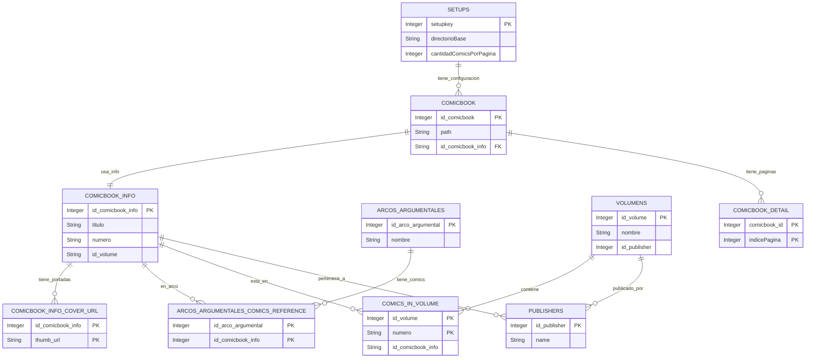

# 📚 Estructura de Datos de Babelcomics

Este documento describe las tablas principales del sistema **Babelcomics**.

## 🗂️ Diagrama de relaciones

Se puede visualizar con Mermaid:

---

## 📋 Descripción de Tablas

### `setups`
Contiene configuración global del sistema: carpeta base, cantidad por página, regex de numerado, etc.

### `comicbooks`
Archivos de cómics físicos (cbz/cbr), su path, calidad, y si está en papelera.

### `comicbooks_info`
Metadata del cómic: título, número, volumen, fecha, resumen.

### `comicbooks_info_cover_url`
URLs de portadas adicionales asociadas a un cómic.

### `arcos_argumentales`
Define arcos narrativos (sagas).

### `arcos_argumentales_comics_reference`
Relaciona cómics con arcos narrativos en orden secuencial.

### `comicbooks_detail`
Información por página de archivo: tipo, orden, nombre.

### `comics_in_volume`
Asociación entre cómics y volumen en ComicVine.

### `publishers`
Editoriales de los cómics, con descripción y logos.

### `volumens`
Volúmenes de series: año de inicio, cantidad de números, editorial asociada.

### `setup_directorios`
Directorios definidos para escaneo de archivos.

### `setup_tipos_archivo`
Extensiones válidas para archivos de cómics.

### `setup_vineKeys`
Claves API de ComicVine.

### `setup_vineKeys_status`
Tracking de uso de claves API.

---
